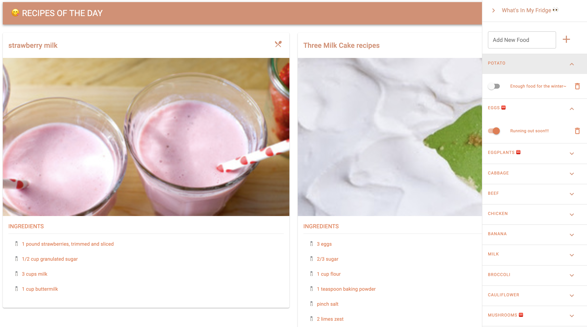

App built with rails + graphql + react(injected using rails-webpacker).

## Installation

Install dependencies

```sh
$ bundle install
```

Setup database

```sh
$ rails db:create
$ rails db:migrate
$ rails db:seed
```

Start the server

```sh
$ rails server
```

Open

```sh
$ open http://localhost:3000/
```

To test graphql queries

```sh
$ open http://localhost:3000/graphiql
```

## To enable recipes fetching

Details of fetch function: `requestURL` in `app/javascript/components/utils/request.js`

API using: [Edamam API](https://developer.edamam.com/)

To use the same API, you must have an account with Edamam API, which gives you APP_ID and API_KEY.

If you have APP_ID and API_KEY already, in the root directory:

```
touch .env
```

And copy following code into the `.env` file:

```
API_KEY=YOUR_API_KEY
APP_ID=YOUR_APP_ID
```

Note: Edamam developer version has very limited requests per minute. There are some code to limit the requests volume. But it would still exceed the limit very easily if the page is refreshed frequently.

## UI example


